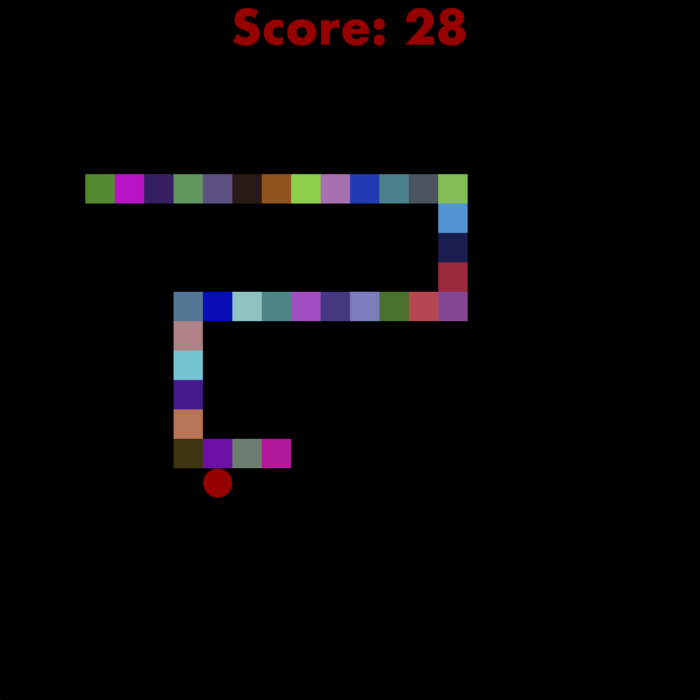

# SnakeGame

Welcome to SnakeGame! This classic game has been recreated in Java to bring you endless fun trying to beat your own high score by controlling a snake to eat apples on the screen. Each apple the snake eats makes it longer and faster. Be careful not to run into the walls or the snake's own tail!

## Features

-   Classic Snake gameplay
-   Score tracking
-   Simple and intuitive GUI
-   Replay Capability
-   Background Music

<p align="center">
  
</p>

## Installation

To play SnakeGame, you will need to download the JAR file from [releases](https://github.com/av1155/SnakeGame/releases) and have Java installed on your computer.

### Prerequisites

-   Java 11 or higher

### Download

You can download the latest version of SnakeGame from the following link:

[Download SnakeGame.jar](https://github.com/av1155/SnakeGame/releases)

## How to Run

After downloading, you can run the game by double-clicking and opening the JAR file, or by executing the following command in your terminal.

```bash
java -jar SnakeGame.jar
```

## How to Play

-   Use the arrow keys (↑, ↓, ←, →) to control the direction of the snake, or you can also use the WASD keys.
-   Try to eat as many apples as possible without colliding with the walls or the snake's body.
-   Each apple eaten increases the score and the length of the snake.

## License

This project is licensed under the MIT License - see the [LICENSE](LICENSE) file for details.
